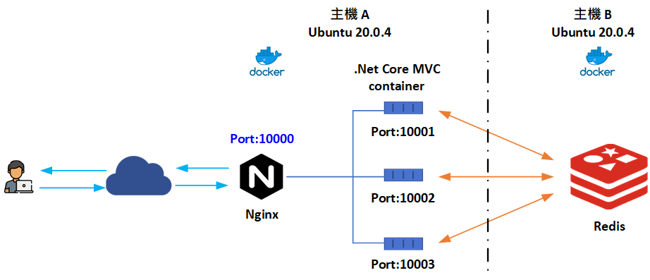

## .Net Core 使用 Redis 做分散式 Session

使用 Redis 做為 Asp.net core 分散式 session 的範例﹐詳細過程參考 [Asp.Net Core 分散式Session – 使用 Redis](https://www.dotblogs.com.tw/nethawk/2023/03/08/net-redis-session) 

本篇範例搭配 Nginx 做 loadbalancer 導流﹐整理架構圖如下

